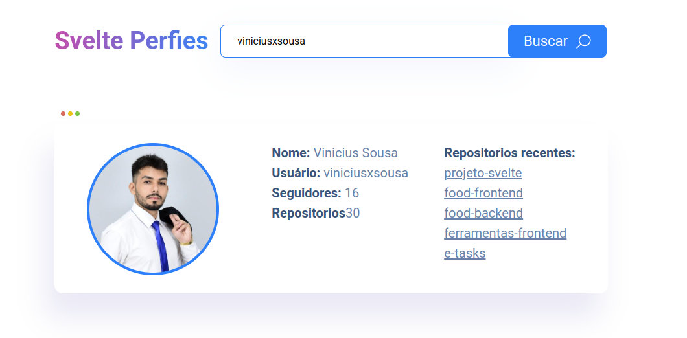

# Projeto Svelte

Este projeto foi desenvolvido com o objetivo de estudar e explorar as capacidades do framework Svelte. A aplicação realiza requisições à API do GitHub para obter e exibir os principais dados de um usuário, como nome, foto de perfil, repositórios e seguidores. Utilizando Svelte, conseguimos criar uma interface leve, rápida e reativa, proporcionando uma experiência de usuário eficiente e agradável. 

### :arrow_forward: Rodando o projeto

1. Faça o clone desse repositório.
2. Rode o comando `npm install`, para instalar as dependências
3. Rode o comando `npm run dev`, para iniciar o projeto

### :atom_symbol: Tecnologias 
* [Svelte](https://svelte.dev/)
* [TypeScript](https://www.typescriptlang.org/)

### :desktop_computer: Previa do Projeto

